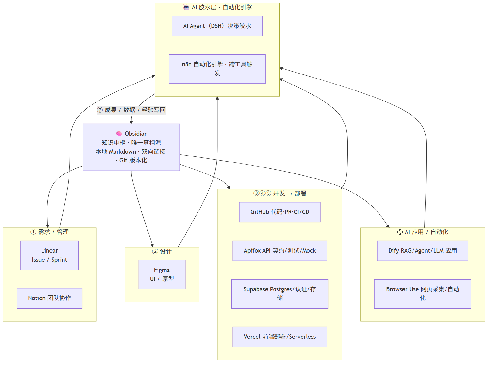

# Obsidian 起点 · 工具串联方案（提效 & 不造轮子）

> 锚点：**Obsidian 是知识中枢 / 唯一真相源（single source of truth）**。
> 核心思路：每款工具提供一块"现成轮子"，AI Agent 当胶水把这些轮子自动串起来，避免自己从零开发。
> 更新：已纳入 **n8n** 作为「AI 胶水层」的自动化引擎，负责把跨工具传递从手动变自动。

## 〇、架构图



**读图顺序**：Obsidian 是唯一中枢（居中）→ 四路输出（管理 / 设计 / 开发部署 / AI 应用）→ 全部汇入上方的「AI 胶水层」→ n8n 负责无人值守的自动触发与跨工具传递，DSH 负责读写与决策 → 成果经"写回"箭头回到 Obsidian，形成自增强闭环。

## 一、总体架构（Obsidian 为中枢）

```
              ┌─────────────── Obsidian（知识中枢，本地 Markdown，Git 版本化）───────────────┐
              │  想法 / 需求 / 规格 / 研究 / 文档 / 决策    ←  一切从这里进，最后回到这里      │
              └──────┬───────────────────┬────────────────────┬────────────────────────────┘
                     │                   │                    │
    ① 需求/管理       │      ② 设计        │     ③④⑤ 开发→部署    │     ⑥ AI 应用 / 自动化
   ┌───────────────┴────┐   ┌───────────┴───┐   ┌──────────────┴─────┐   ┌─────────────────────┐
   │ Linear            │   │ Figma         │   │ GitHub  (代码+CI/CD) │   │ Dify  (RAG/Agent/LLM)│
   │ (Issue/Sprint)    │   │ (UI/原型)      │   │ Apifox  (API契约/测试)│   │ Browser Use (网页自动化)│
   │ Notion(团队可选)   │   │               │   │ Supabase (后端/认证)  │   │  ↑ 回环写回 Obsidian   │
   └───────────────┬───┘   └───────────┬───┘   │ Vercel  (前端部署)    │   └───────────┬─────────┘
                   │                   │   └──────────────┬─────┘               │
                   └───────────────────┴──────────────────┘                   │
                            ┌───────────────────────────────────────────────┘
                            ▼
               ┌─────────────────────────────────────────────────────────────┐
               │  n8n  AI 胶水层 / 自动化引擎（把上面所有工具串成一个自动整体）│
               │  事件/定时/Webhook 触发 → 跨工具传递 → AI Agent 调用 → 写回    │
               └─────────────────────────────────────────────────────────────┘
```

## 二、环境起点：Obsidian = 中枢，为什么要锚定它

- **本地 Markdown + 双向链接**：数据在你自己手里、可搜索、可被 AI 直接读写。
- **天然可版本化**：把 Obsidian 库作为一个 Git 仓库推到 GitHub —— 一举三得：**备份、版本历史、AI 可读取**。
- **AI 友好**：纯文本意味着 DSH 这类 Agent 能直接解析、改写、生成你的知识与文档。

## 三、串联后的提效流程（端到端 7 步）

**Step 1 捕捉**：想法/需求/竞品/研究 → 写成 Obsidian 笔记（这就是你的"需求池"）。
**Step 2 分工**：把 Obsidian 里的需求转化成任务 → 同步到 **Linear**（Issue/Sprint）；团队场景用 Notion 补充结构化协作。
**Step 3 设计**：需要界面 → **Figma** 出 UI/原型，设计即产物。
**Step 4 开发**：
- **GitHub**：代码 + PR 评审 + Actions（CI/CD），Obsidian 库也在这里做版本。
- **Apifox**：先把接口契约/文档/Mock 定好 → 前后端并行，不用等接口。
- **Supabase**：直接用现成的 Postgres + 认证 + 存储 + 实时推送 + 自动 API，**不自己写后端**。
**Step 5 部署**：push 到 GitHub → **Vercel** 自动构建、出预览、上生产（HTTPS/CDN/Serverless 全含），**不自己搭托管**。
**Step 6 AI 应用**：**Dify** 把 LLM/RAG/Agent 可视化搭起来做产品内 AI；**Browser Use** 让 AI 操作网页做采集/自动化。
**Step 7 回环**：成果、数据、经验由 **AI** 写回 Obsidian 笔记 → 知识库长大 → 再喂给 Dify 的 RAG，形成自增强闭环。

> **自动化的关键**：Step 1→7 的"传递"（如 GitHub 事件→更新 Linear、Dify 生成→写 Obsidian、定时采集→汇总上报）由 **n8n** 负责自动触发与串联，无需手动搬运。

## 四、"每款工具省掉你造哪个轮子"（核心表）

| 工具 | 替你省掉自己开发的轮子 |
|---|---|
| **Obsidian** | 知识库/链接/本地私有存储（= 别自己写笔记+知识系统） |
| **GitHub** | 代码托管、分支、PR、CI/CD（= 别自己搭版本+构建测试） |
| **Supabase** | 认证、数据库、文件存储、实时、自动 API（= 别自己写后端） |
| **Vercel** | 托管、HTTPS、CDN、自动部署、Serverless（= 别自己搭部署基建） |
| **Dify** | RAG 管道、向量库、LLM 编排、Agent 工具（= 别自己写 RAG/Agent） |
| **Browser Use** | 网页抓取/操作机器人（= 别自己写爬虫/自动化脚本） |
| **Apifox** | 接口文档、Mock、自动化测试、契约（= 别自己写测试工具） |
| **Linear** | Issue/Sprint/迭代管理（= 别自己建看板流程） |
| **Figma** | UI 设计/原型（= 别自己做设计工具链） |
| **Notion** | 可选：团队结构化文档协作 |
| **n8n** | 跨系统自动化编排 + AI Agent 集成（= 别自己写自动化脚本/对接代码） |

## 五、AI Agent（DSH）与 n8n = 胶水，把链自动化跑起来

**AI（DSH）** 不只写在笔记里，而是**实际操作这些轮子**：
- **读/写 Obsidian**：解析你的需求笔记 → 生成规格/任务 → 写回笔记。
- **写代码 → 提交 GitHub**：把规格翻译成代码，commit + push，触发 CI。
- **调 Dify / Supabase / Browser Use**：通过 API 编排 AI 应用、读写数据、驱动网页自动化。
- **生成"胶水代码"**：自动写各工具的 SDK 调用 / 客户端代码，减少你手工拼接。

**n8n** 则承担**常驻的自动化调度**（7×24 无人值守地跨工具传递）：
- **事件/定时/Webhook 触发**；跨工具调用（GitHub、Linear、Dify、Obsidian、Slack…）。
- **AI Agent 节点**：让模型自主决定调用哪些工具/API 完成多步任务，把"智能体 + 自动化"二合一。
- 与 **Dify 互补**：Dify 构建 AI 应用/知识库，n8n 做自动化流程 + 跨系统集成。

> 这样"造轮子"被降到最低：你只关心**业务逻辑**，其余基建和能力都由现成工具 + AI/n8n 编排承担。

## 六、落地建议（避免一次性全上）

**首批（高杠杆、几乎零成本）**
1. 把 Obsidian 库推到 GitHub（备份 + 版本 + AI 可读）。
2. 用 Dify 基于 Obsidian 笔记做 RAG 知识库 → 你的 AI 能"用你的知识"回答。

**第二阶段（做产品时）**
3. GitHub + Vercel + Supabase 三件套：代码、部署、后端一次跑通。

**第三阶段（AI 能力/自动化）**
4. Dify 做产品内 AI、Browser Use 做网页采集；Apifox 管接口契约；Linear 管迭代；Figma 出设计；**n8n 把这套串成自动运行的流程**。

## 七、一句话结论
**Obsidian 当"大脑"，AI Agent（DSH）当"决策胶水"，n8n 当"自动化引擎"，其余每款工具都提供一块现成轮子。** 起点就两步：把 Obsidian 库推上 GitHub、用 Dify 把笔记喂成你自己的 AI 知识库——立刻见效，再按需用 n8n 把整条链自动跑起来。
